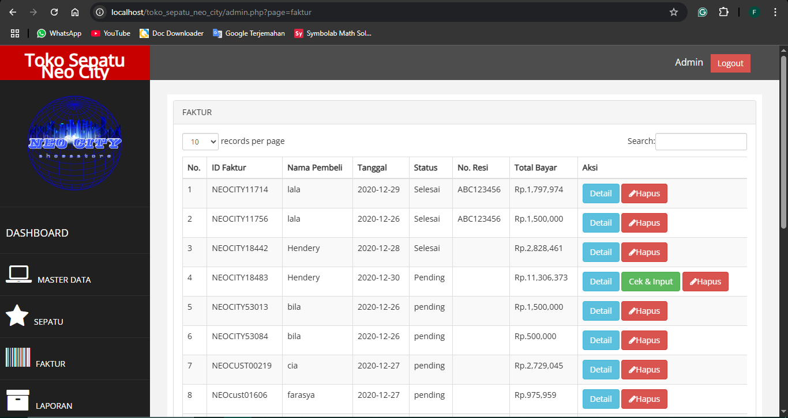
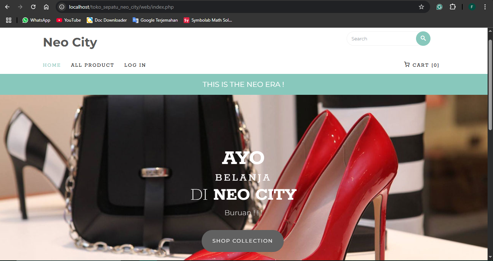

# Neo City Shoe Store - Database & Web Application System

This project implements an integrated information system for the Neo City Shoe Store, consisting of a MySQL/MariaDB relational database and two accompanying web applications.

## Project Overview

This system is designed to comprehensively manage shoe store operations. The database serves as the core storage for product data, transactions, and user information. Two separate web interfaces are provided to facilitate administrative needs and the customer shopping experience:

1.  **Administration Website (Backend):** Built with PHP, this interface provides functionality for store staff, such as viewing and managing invoices, product master data (shoes, types, brands, models, sizes, colors), and new product input features.
2.  **Customer Website (Frontend):** Built with pure HTML, CSS, and JavaScript, this is the interface accessed by customers to browse the shoe catalog, search for products, and make purchases.

## Technologies Used

* **Database Management System (DBMS):** MySQL/MariaDB (dump file generated with phpMyAdmin 5.0.2)
* **Administration Website (Backend):** PHP
* **Customer Website (Frontend):** HTML, CSS, JavaScript
* **Web Server:** Apache/Nginx (via XAMPP/WAMP/MAMP recommended for local development)

## Database Structure (Schema)

The `toko_sepatu_neo_city` database consists of several interrelated tables. For a detailed understanding of the database design and relationships, please refer to the Entity-Relationship Diagram (ERD) provided in the documentation.

* **View the ERD Document:** [Neo City Shoe Store ERD](docs/neo-city-shoe-store-erd.pdf)

---

## How to Install and Run the Project

Follow these steps to set up and run this project in your local environment:

### 1. Prerequisites

* **XAMPP/WAMP/MAMP:** Ensure you have a local server environment (e.g., XAMPP for Windows/Linux, WAMP for Windows, MAMP for macOS) installed and running, including Apache and MySQL/MariaDB.

### 2. Database Setup

1.  **Create Database:**
    * Open your database management tool (e.g., phpMyAdmin via `http://localhost/phpmyadmin/`).
    * Create a new database named `toko_sepatu_neo_city`.
2.  **Import Schema and Data:**
    * Select the newly created `toko_sepatu_neo_city` database.
    * Click on the "Import" tab.
    * Choose the `database/toko_sepatu_neo_city.sql` file from your project folder.
    * Click "Go" to start the import process.

### 3. Website Setup

1.  **Move Website Files:**
    * Copy the entire contents of the `backend-admin-website/` folder into a sub-folder within your web server's `htdocs` (for XAMPP/WAMP) or `htdocs`/`www` (for MAMP) directory. Name this folder `admin-toko-sepatu` or as desired.
        * *Example Path:* `C:\xampp\htdocs\admin-toko-sepatu\`
    * Do the same for the `frontend-customer-website/` folder. Copy its contents into another folder within `htdocs` (e.g., `customer-toko-sepatu`).
        * *Example Path:* `C:\xampp\htdocs\customer-toko-sepatu\`
2.  **Database Connection Configuration (If Necessary):**
    * Check the database connection file within your `backend-admin-website/` folder (typically `koneksi.php` or similar). Ensure the host, username, password, and database name match your local MySQL/MariaDB configuration (usually `host: localhost`, `username: root`, `password: ` (empty) for default XAMPP).
    * For the customer website (pure HTML), there is typically no direct database connection on the client-side. If data requests are made, they would be through an API from the admin website or another backend. Ensure any API paths or endpoints (if present) are correct.

### 4. Running the Applications

1.  **Access the Administration Website:**
    * Open your web browser and navigate to `http://localhost/admin-toko-sepatu/` (adjust to the folder name you used).
    * **Default Admin Login:**
        * Username: `farasya`
        * Password: `neocity`
2.  **Access the Customer Website:**
    * Open your web browser and navigate to `http://localhost/customer-toko-sepatu/` (adjust to the folder name you used).

## Project Screenshots

Here are some visual representations of the project:

### Admin Dashboard Page

### Customer Homepage

## Contributing

If you have suggestions or improvements for this system, feel free to open an issue or submit a pull request.

## License

This project is licensed under the [MIT License](https://opensource.org/licenses/MIT).
